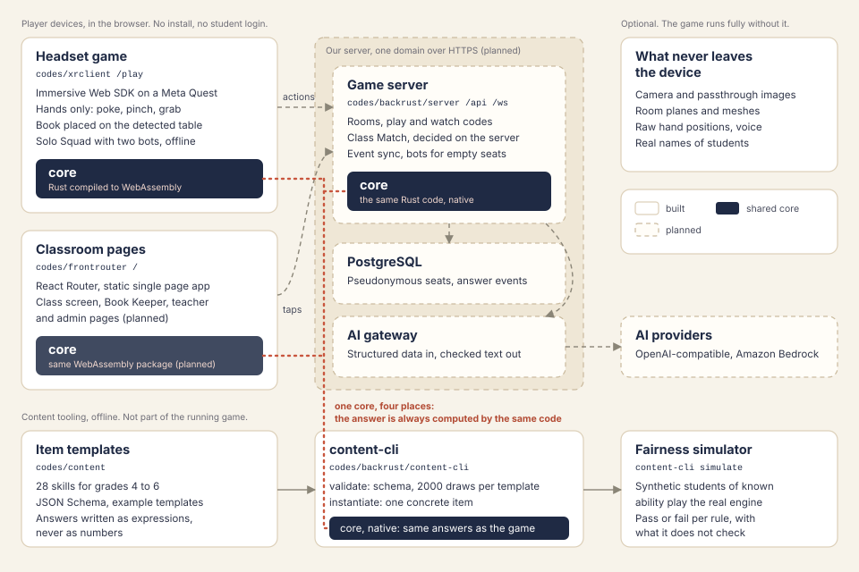

# Numeria Arena

> A hands-first mixed reality math game for grades 4 to 6: a pop-up paper book opens on the player's real desk, origami creatures carrying numbers wander out, and players fold them home by answering with their hands, while an adaptive engine keeps every child at their own level.


Built for the **Meta VR Start Developer Competition 2026** (Devpost), Gaming track, New Experience division.

Status: early development. No public build yet; the link will be added here when it is deployed.

## Table of Contents

- [What it is](#what-it-is)
- [Who it is for](#who-it-is-for)
- [How to test](#how-to-test)
- [Architecture](#architecture)
- [Running locally](#running-locally)
- [Configuration](#configuration)
- [Results](#results)
- [What it does not claim](#what-it-does-not-claim)
- [Roadmap](#roadmap)
- [Credits and licenses](#credits-and-licenses)
- [How this was built](#how-this-was-built)
- [License](#license)

## What it is

Numeria Arena is an **immersive mathematics game** for primary school, grades 4 to 6. It runs in the Meta Quest browser through WebXR, so there is nothing to install. In mixed reality the game lives on the player's own real desk: the headset finds the table, a pop-up paper book opens on it, and every question becomes something to reach for, pinch, poke and place with the hands. The same game also opens in an ordinary browser window for computers and classroom smartboards.

### Math Edu Game

The maths is the action, not a quiz with 3D decoration around it. 28 skills common to most curricula (place value, multiplication and division, fractions, decimals and measurement) come from 206 validated question templates. Every answer is computed by one exact fraction engine, so `0.1 + 0.2` is `0.3`, and no answer is ever typed in by a person or written by an AI model. Everything is in English and Indonesian.

### Learn

Math Lessons offers step-by-step paper lessons for grades 4 to 6, which can also be viewed in VR. Each game opens with a skippable 10-second tutorial in which a paper hand shows the first move without giving the answer away. A wrong answer earns a soft paper "boing" and a second try, never a buzzer. A teacher's report links every weak skill to the matching lesson.

### Play

Origami creatures walk out of the book on the desk, each carrying a problem, and the child answers in space:

- **Orb Forge:** grab two number crystals and merge them into an orb of exactly the right value.
- **Balloon Burst:** poke the balloon that holds the right answer.
- **Factory Sort:** carry each creature from the conveyor to the right gate.
- **Bridge Builder:** lay fraction and decimal planks until the gap is exactly spanned.
- **Balance Gate:** place number weights until the scale balances.

Children can practise alone, race two clearly labelled robot rivals through three timed waves and a final, race their classmates (up to six desks per match, with robots filling empty seats), find a rival of the same grade, or race side by side at one smartboard. Hands work from start to finish, and controllers work too. Play is seated with no artificial movement, so it stays comfortable.

### Create

Right answers earn **Folds**, which build the child's own **Fold Town** on the desk. The child pinches one of 214 pieces from a paper shop shelf, from roads and trees to houses, a stadium and an airport, and places it on the land in mixed reality. A finished land (plain, river, hills or coast) opens the next one. Every building carries a maths card fitted to the child's grade, showing area, perimeter, volume and fractions of the land, and a FINISH NOW question completes it at once. Skill landmarks cannot be bought: they grow only from skill stars, so the town tells the story of what the child has learned.

### Accessibility friendly

- **NO TIMER** removes the clock and the speed bonus from every game.
- **BIG NUMBERS**, **HIGH CONTRAST** and **READ ALOUD** (English or Indonesian) help children who see or read less easily.
- **STEADY AIM** smooths shaky hands and controller rays, and every game can be played one-handed.
- Right and wrong are always shown by shape and motion, never by colour alone, and text uses the Atkinson Hyperlegible typeface.

### Fairness and integrity

The **Fairness Engine** gives every child problems they should answer correctly about three times in four, and scores each right answer against that expectation. A strong and a weak student therefore earn points at nearly the same pace (5.8% apart in a 1000-student simulation), so classmates can race each other without prior ability deciding the race. Robots never pretend to be people.

Because every answer is an action on objects in space, each round is **action-based authentic assessment**. Class races are judged by the server against a clock the server keeps, which leaves little room for copied text, instant AI answers or switching to another device. Teachers get a more honest, valid and consistent picture of what each child can actually do.

### AI analysis for teachers

On top of the rule-based report, which always works (STRONG, MIDDLE, NEEDS PRACTICE, NOT ENOUGH DATA), the teacher can ask for an **AI class insight** and an **AI practice plan** for each student, in English or Indonesian. The insight names what the class does well, what needs work and what to do next. The practice plan picks the one to three skills most worth practising first, explains what the answers show, and gives one next step for each.

- The model only sees numbers: seat numbers, skill titles, counts and misconception codes, never a name or any text from a child.
- Every answer is checked against those numbers before the teacher sees it, and it is labelled as made by AI. If a check fails, the rule-based insight is shown instead.
- Children never talk to an AI, and AI never writes questions or answers.
- The admin chooses the provider (any OpenAI-compatible service or Amazon Bedrock). API keys are stored encrypted on the server, and a monthly budget falls back to rule-based text when it runs out.

### Teacher-managed class races

The teacher runs the race, not the game. From the class page the teacher opens a race room and chooses the games, the number of rounds, the seconds per round and the level of the questions (adaptive, easier or harder). The room gets a play code for the children and a watch code for the **class screen** on the projector. Children join from their headsets, press I'M READY, and the teacher starts the match for every desk at once.

- A large class races in groups of six desks, and the class screen calls each group in turn.
- Robots marked BOT fill empty desks, and a robot helper keeps a desk busy if a child steps away, earning no points.
- The class screen shows waves, the boss round, results and highlights, but never a child's question. The teacher can send cheers to every desk.
- With few headsets, the teacher can start a **smartboard race** for up to three children at one touch screen and save the results in the class report.

### Made for the classroom

**MY CLASSES** gives each class up to 100 seats, each with a fixed pseudonym and a picture password, along with printable sign-in cards and groups for taking turns. Reports show each skill and each seat by first tries, the most-missed questions and the most common misconceptions. Leaderboards cover the class and the world, and a class town map shows every student's land. Anyone can open a sample teacher page without an account.

### Safe for children and ready offline

Children never enter a name or an email. Real names stay in the teacher's browser, and camera, room and voice data never leave the device. Practice and robot races keep working offline after the first visit.

## Who it is for

| | |
|---|---|
| Players | Grades 4 to 6, ages 10 to 12 |
| Topics | Place value, multiply and divide, fractions, decimals, measurement: 28 skills common to most curricula |
| Languages | English, Bahasa Indonesia. Decimal point in both, no thousands separator |
| Accounts | None for students. Pseudonyms only; real names stay in the teacher's browser |

## How to test

There is nothing to test in a headset yet. What runs today:

1. Start the game in the browser emulator (see [Running locally](#running-locally)) and open `https://localhost:3322`.
2. Enter XR with hand input on the Meta Quest 3 preset in the `living_room` environment. A test button and a crystal appear on the detected table: poke the button, pinch and move the crystal.
3. The browser console shows the Rust core running as WebAssembly: exact sums such as `0.1 + 0.2 = 0.3`, and one concrete fraction item.
4. Validate the example templates and run the fairness simulation with `content-cli` (commands below).

## Architecture



Choices worth knowing:

- **One core, four places.** Item generation, the expression language, the number formatter and the Fairness Engine are written once in Rust. The headset and the classroom pages use it as WebAssembly, the server and the content tool natively. The same template and seed give the same item, byte for byte, on both.
- **Exact fractions.** Every expression is computed with exact fractions, so `0.1 + 0.2` is `0.3` and `2/8` can still be shown as `2/8` when a skill needs it.
- **Templates are validated before they are used.** 2000 random draws per template check constraints, answers, distractors, prompt length and difficulty, and every failure is named with an example. Distractors that collide are dropped exactly as the game drops them.
- **The headset is designed to work without the server.** Solo play with bots will run offline, so the game stays playable if the server is down. The core already runs in the browser; the bots come next.
- **Hands first.** Hand pinch grab is switched on explicitly; the SDK leaves it off by default.

```
codes/
  xrclient/        Immersive Web SDK game (TypeScript, Vite)
  frontrouter/     React Router single page app for 2D pages
  backrust/
    core/          exact fractions, expression language, formatter, templates,
                   validator, Fairness Engine, simulator (native and WebAssembly)
    content-cli/   validate, instantiate, simulate
  content/         skills, JSON schemas, example item templates
assets/            diagrams
```

## Running locally

Requires Rust (the toolchain is pinned in `rust-toolchain.toml`), Bun 1.4 and Node 24 or newer.
For the WebAssembly build also `wasm-bindgen` CLI 0.2.129, exactly the crate version:

```bash
cargo install wasm-bindgen-cli --version 0.2.129 --locked
```

Core tests, template validation and the fairness simulation:

```bash
cd codes/backrust && cargo test
```

```bash
cd codes/backrust && cargo run -p content-cli -- validate ../content/contoh/*.json
```

```bash
cd codes/backrust && cargo run --release -p content-cli -- simulate
```

Game in the emulator:

```bash
cd codes/backrust && ./build-wasm.sh
```

```bash
cd codes/xrclient && bun install && bun x iwsdk dev up
```

Classroom pages:

```bash
cd codes/frontrouter && bun install && bun run dev
```

Ports: frontrouter 3320, server 3321 (planned), game 3322.

## Configuration

Nothing to configure yet. Server settings (database, sign-in for adults, AI providers)
will be listed here when the server exists.

| Setting | Where | Purpose |
|---|---|---|
| `iwsdk.config.json` | xrclient | XR features, emulator device and room, hand pinch grab |
| `WASM_BINDGEN` | build-wasm.sh | path to a `wasm-bindgen` 0.2.129 binary if it is not on `PATH` |

## Results

Measured, not claimed. Everything below is reproducible with the commands above.

### Template validator

168 templates, six for each of the 28 skills (place value, multiplication and division,
fractions, decimals, measurement), all pass (`content-cli validate`). 158 of them are
drafts written with an AI model and still await review by a teacher; the game uses them
for now so every skill can be played.

The first run failed like-fraction addition: when both numerators are 1, "adding the
denominators" and "multiplying the numerators" give the same wrong answer, in 15.5% of
items. The rule now matches what the game does: a distractor equal to the answer or to
an earlier one is dropped, and at least two different distractors must remain in 90%
of items. For 1/5 + 1/5 the balloons show 2/5, 2/10 and 3/5. That template now keeps
two different distractors in every item.

### Fairness Engine simulation

1000 synthetic students of known ability, 12 candidate items per pick, item difficulties
known to the engine only with noise; 1000 three-desk matches of 8 minutes.
Parameters `fp-2026-09-29.2`.

| Check | Result | Limit |
|---|---|---|
| Ability error after 40 items | 0.307 | under 0.35 |
| Points per minute, strong vs weak student | 5.8% apart | under 15% |
| Points per minute in a first session, strong vs weak | 13.8% apart | under 15% |
| Matches where a desk piles up (12 or more waiting) | 0 | 0 |
| Matches where highlights were not unique for every player | 0 | 0 |

- **Fairness needed easy items, not a new formula.** With item difficulty limited to -3 the weakest students ran out of items at their level and earned 16.0% fewer points per minute. Allowing templates down to -4 closed most of the gap.
- **The first session was the hardest part.** Starting from the grade level, weak students first earned 27.1% fewer points. Eight placement items, a larger step down after a wrong answer and easier items together bring it to 13.8%, which passes, but only just.
- **A first design was wrong and the simulator caught it.** Spawning creatures at a fixed pace piled them up in 983 of 1000 matches; the pace now follows each player's own correct answers.

### Race against two robot rivals

Each player races two clearly labelled robots at their own desks. The race runs on a
clock: three waves of 60 seconds and a 20 second boss round worth double. Creatures keep
arriving at every desk until time is up; a creature still open at the whistle goes home
without points and a late answer is refused. Points use the same formula for everyone, and
before each round the robots are re-drawn near the player's level and pace (the median time
of the player's first tries last round, kept between 3 and 15 s, times 0.85 to 1.15).
100 races per cell, a simulated player right with a fixed chance and a fixed time per answer,
places 1st / 2nd / 3rd:

| Time per answer | right 50% | right 75% | right 90% |
|---|---|---|---|
| 4 s | 9 / 27 / 64 | 89 / 9 / 2 | 100 / 0 / 0 |
| 6 s | 8 / 20 / 72 | 65 / 27 / 8 | 93 / 7 / 0 |
| 10 s | 2 / 8 / 90 | 24 / 37 / 39 | 64 / 31 / 5 |

- Being right matters most: at any pace, a player right 90% of the time usually wins and a player right half the time usually comes last.
- Speed helps without deciding everything. In an earlier run (with the first ten templates) where the robots did not follow the player's pace, a 10 s player right 75% of the time won only 11 of 100 races and a 4 s player always won.
- A real player who struggles gets easier items and relief after two misses, which this fixed-chance simulation leaves out.
- Every round ends on its clock, no robot answers outside a round, places always follow points, the same seed gives the same race, and every player gets a different highlight (`cargo test --test race`).

### Emulator checks

On the Meta Quest 3 preset with hand input: the table in the synthetic room is detected
(1.30 x 0.75 x 0.79 m), two pokes register exactly twice, and a pinched crystal moves
0.150 m and is released.

A full race played by the emulator test driver with hand pokes and pinches
(`node scripts/emulator/drive.mjs race`): the menu envelope opens, three timed waves
and a boss round, a live scoreboard for all three players, and results with
places, stars and a different highlight each. In the browser preview the same game plays
with a mouse: clicking an envelope, a balloon, or two crystals in turn.

## What it does not claim

- **No frame rate is claimed.** Nothing has been measured on a headset; the emulator runs on a desktop GPU.
- Hand tracking has only been exercised in the emulator, which does not reproduce real tracking noise.
- The simulation uses synthetic students and a synthetic item bank. Real students will differ.
- It is not a curriculum and does not grade students. Skill stars are a guide for teachers.
- The example scene still uses the SDK's starter assets; they will be replaced by the game's own paper art.

## Roadmap

Planned, not built. Nothing here is a result.

- **Two games playable solo with bots:** Orb Forge and Balloon Burst, then Factory Sort, Bridge Builder, Balance Gate and Measure Hunt.
- **Class Match** on a server that decides every answer, with a class screen for the room and Book Keeper for students without a headset.
- **Real item bank:** six templates per skill, including very easy ones, then the simulation run again on real difficulties.
- **Accessibility:** one-handed play, head-gaze and dwell, high contrast, captions, no-timer mode.
- **Pip, the paper owl coach**, as an optional AI layer that only receives structured data.

## Credits and licenses

- **Immersive Web SDK** (Meta Platforms, MIT) with its emulator, and **super-three** (MIT).
- **@pmndrs/uikit** (MIT), icons from **Lucide** (ISC).
- **React Router**, **React**, **Tailwind CSS**, **Vite** (MIT), **TypeScript** (Apache-2.0).
- **serde**, **serde_json**, **sha2**, **wasm-bindgen** (MIT or Apache-2.0), **jsonschema** (MIT).
- **Bun** (MIT) as package manager and script runner.
- **Origami models** (book, paper bird, flag, partner robots) from [orimathassets](https://github.com/sayazia/orimathassets), made by the same owner for this game, CC0 1.0. Copied by `scripts/sync-assets.mjs`, which records the source commit in `public/models/manifest.json`. The folded animals, crystals, balloons, portal, stars, badges, orb, buttons and rival windows are drawn in code (`src/art/`). All eight creatures (dog, rabbit, bird, chicken, cow, fish, cat, elephant) are the project owner's own paper models (8 to 85 KB each); their panels come sorted into tones, which the game repaints evenly from the creature's colour.

## How this was built

A code assistant was used to speed up development and debugging. Design
decisions, measurements and claims were checked by hand against real runs.

Findings that changed the design so far:

- **Grab by hand is off by default in the SDK.** Without switching it on, the game would not be playable with hands alone.
- **The simulator overruled the first load-balancing design.** A fixed spawn pace piled creatures up almost every match.
- **Fairness depends on content, not only on the formula.** The weakest students need easy items to exist, so templates may now go easier than first planned.

## License

MIT, see [LICENSE](LICENSE).
